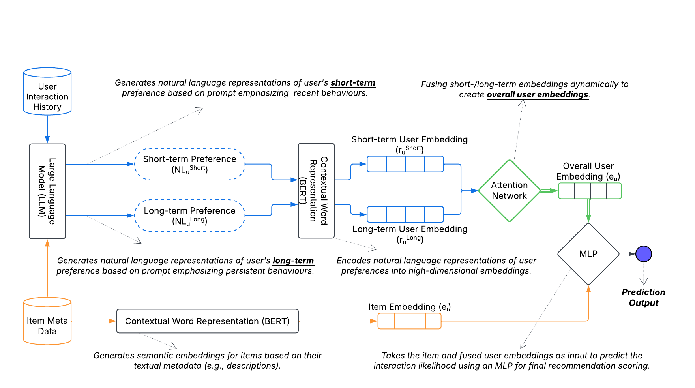
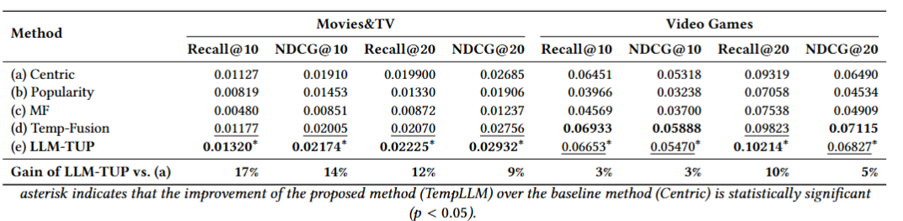
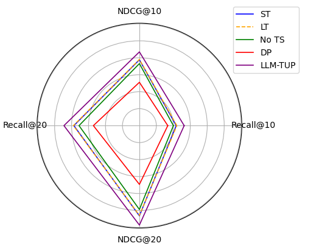

# LLM-TUP: Temporal User Profiling with LLMs; Balancing Short-Term and Long-Term Preferences for Recommendations 
 

## 📌 Overview  
  

Accurately modeling user preferences is crucial for improving the performance of content-based recommender systems. Existing approaches often rely on simplistic user profiling methods, such as averaging or concatenating item embeddings, which fail to capture the nuanced nature of user preference dynamics, particularly the interactions between long-term and short-term preferences. In this work, we propose LLM-enhanced Temporal User Profiling (LLM-TUP), a novel method for user profiling that explicitly models short-term and long-term preferences by leveraging interaction timestamps and generating natural language representations of user histories using a large language model (LLM). These representations are encoded into high-dimensional embeddings using a pre-trained BERT model, and an attention mechanism is applied to dynamically fuse the short-term and long-term embeddings into a comprehensive user profile. Experimental results on real-world datasets demonstrate that LLM-TUP achieves substantial improvements over several baselines, underscoring the effectiveness of our temporally aware user-profiling approach and the use of semantically rich user profiles, generated by LLMs, for personalized content-based recommendation.

Proposed Architecture for LLM-Driven Temporal User Profiling

---

## 🚀 Key Features  
- **LLM-Driven Profiling**: Uses OpenAI’s GPT-4o-mini to transform interaction histories into **natural language preference representations**.  
- **Temporal Awareness**: Captures both **short-term** and **long-term** user behaviors, ensuring personalized recommendations.  
- **Attention-Based Fusion**: Dynamically combines short-term and long-term embeddings for each user, **personalizing weight distribution**.  
- **Seamless Integration**: Designed to be compatible with **existing recommendation models**, enhancing user representations without requiring architectural changes.  

---

## 🏗️ Components  
### 1️⃣ **User Profile Generation with LLMs**  
- The **entire interaction history** (with timestamps) is passed to the **LLM twice**:  
  - **Pass 1**: Generates a **short-term preference profile**.  
  - **Pass 2**: Generates a **long-term preference profile**.  

### 2️⃣ **Embedding Creation with BERT**  
- Both **LLM-generated textual representations** are **encoded into embeddings** using a **pre-trained BERT model**.  

### 3️⃣ **Attention-Based Fusion**  
- The **short-term and long-term embeddings** are **dynamically weighted** using an **attention mechanism**, adapting to each user’s behavioral patterns.  

### 4️⃣ **Final Recommendation Prediction**  
- The **fused user embedding** is combined with **item embeddings** and passed through an **MLP** to predict interaction likelihood.  

---
Performance Comparison our LLM-TUP method and baselines on Movies\&TV and Video Games datasets for \(K=10\) and \(K=20\).

---
Comparison of the proposed method against ablated variants on the Movies dataset, illustrating how each approach ranks items (Recall@10, Recall@20) and captures relevance (NDCG@10, NDCG@20) at various cutoff points.
